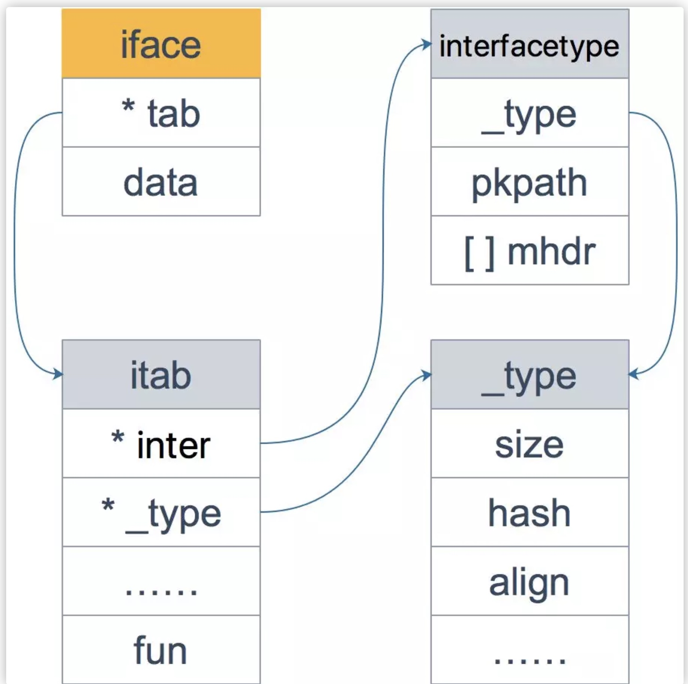

# Interface  
Duck Typing，鸭子类型，是动态编程语言的一种对象推断策略，它更关注对象能如何被使用，而不是对象的类型本身。Go 语言作为一门静态语言，它通过通过接口的方式完美支持鸭子类型。

Go 语言作为一门现代静态语言，是有后发优势的。它引入了动态语言的便利，同时又会进行静态语言的类型检查，写起来是非常 Happy 的。Go 采用了折中的做法：不要求类型显示地声明实现了某个接口，只要实现了相关的方法即可，编译器就能检测到。

总结一下，鸭子类型是一种动态语言的风格，在这种风格中，一个对象有效的语义，不是由继承自特定的类或实现特定的接口，而是由它"当前方法和属性的集合"决定。Go 作为一种静态语言，通过接口实现了 鸭子类型，实际上是 Go 的编译器在其中作了隐匿的转换工作。

## 值接收者和指针接收者的区别方法
不管方法的接收者是什么类型，该类型的值和指针都可以调用，不必严格符合接收者的类型。


| - | 值接受者 | 指针接受者 |
| --- | --- | --- |
| 值类型调用者 |  <div>方法会使用调用者的一个副本，类似于“传值”</div>| 使用值的引用来调用方法，上例中，qcrao.growUp() 实际上是 (&qcrao).growUp() |
| 指针类型的调用者 | 指针被解引用为值，上例中，stefno.howOld() 实际上是 (*stefno).howOld() | 实际上也是“传值”，方法里的操作会影响到调用者，类似于指针传参，拷贝了一份指针 |

### 值接收者和指针接收者

前面说过，不管接收者类型是值类型还是指针类型，都可以通过值类型或指针类型调用，这里面实际上通过语法糖起作用的。

先说结论：实现了接收者是值类型的方法，相当于自动实现了接收者是指针类型的方法；而实现了接收者是指针类型的方法，不会自动生成对应接收者是值类型的方法。

具体来看例子：

```go

package main

import "fmt"

type coder interface {
    code()
    debug()
}

type Gopher struct {
    language string
}

func (p Gopher) code() {
    fmt.Printf("I am coding %s language\n", p.language)
}

func (p *Gopher) debug() {
    fmt.Printf("I am debuging %s language\n", p.language)
}

func main() {
    var c coder = &Gopher{"Go"}
    c.code()
    c.debug()
}
```

结构体 Gopher，它实现了两个方法，一个值接收者，一个指针接收者。最后，我们在 main 函数里通过接口类型的变量调用了定义的两个函数。

运行一下，结果：

```go

I am coding Go language
I am debuging Go language
```
但是如果我们把 main 函数的第一条语句换一下：

```go
func main() {
    var c coder = Gopher{"Go"}
    c.code()
    c.debug()
}

```


```go
./main.go:24:6: cannot use Programmer literal (type Programmer) as type coder in assignment:
    Programmer does not implement coder (debug method has pointer receiver)
```

看出这两处代码的差别了吗？第一次是将 &Gopher 赋给了 coder；第二次则是将 Gopher 赋给了 coder。

第二次报错是说，Gopher 没有实现 coder。很明显了吧，因为 Gopher 类型并没有实现 debug 方法；表面上看， *Gopher 类型也没有实现 code 方法，但是因为 Gopher 类型实现了 code 方法，所以让 *Gopher 类型自动拥有了 code 方法。

对于上述现象的解释：接受者是**指针类型**的方法，很可能在方法中**会对**接受者的属性进行更改操作，从而影响接受者；而对于接受者是**值类型**的方法，方法中**不会对**接受者本身产生影响。

所以，当实现了一个接收者是值类型的方法，就可以自动生成一个接收者是对应指针类型的方法，因为两者都不会影响接收者。但是，当实现了一个接收者是指针类型的方法，如果此时自动生成一个接收者是值类型的方法，原本期望对接收者的改变（通过指针实现），现在无法实现，因为值类型会产生一个拷贝，不会真正影响调用者。

**记住这句话：如果实现了接受者是值类型的方法，会隐式地也实现了接受者是指针类型的方法。对于接受者是指针类型的不成立，不会隐式的实现接受者是值类型的方法，因为值类型的不会修改接受者的数据。**

### 二者分别在何时使用

如果方法的接受者是值类型，无论调用者是**对象还是对象指针**，修改的都是对象的副本，不影响调用者；如果方法的接受者是**指针类型**，则调用者修改的是指针指向的**对象本身**

**使用指针作为方法的接受者的理由**
- 方法能够修改接受者执行的值
- 避免在每次调用方法时复制该值，在值的类型为大型结构体时，这样做会更加高效

**是使用值接收者还是指针接收者，不是由该方法是否修改了调用者（也就是接收者）来决定，而是应该基于该类型的本质。**

如果类型具备“原始的本质”，也就是说它的成员都是由 Go 语言里内置的原始类型，如字符串，整型值等，那就定义**值接收者类型**的方法。像内置的引用类型，如 slice，map，interface，channel，这些类型比较特殊，声明他们的时候，实际上是创建了一个 **header**， 对于他们也是直接定义**值接收者类型**的方法。这样，调用函数时，是直接 copy 了这些类型的 **header**，而 **header** 本身就是为复制设计的。

如果类型具备非原始的本质，不能被安全地复制，这种类型总是应该被共享，那就定义指针接收者的方法。比如 go 源码里的文件结构体（struct File）就不应该被复制，应该只有一份实体。

## iface 和 eface 的区别是什么
iface 和 eface 都是 Go 中描述接口的底层结构体，区别在于 iface 描述的接口包含方法，而 eface 则是不包含任何方法的空接口：interface{}。

iface 内部维护两个指针，tab 指向一个 itab 实体， 它表示接口的类型以及赋给这个接口的实体类型。data 则指向接口具体的值，一般而言是一个指向堆内存的指针。

再来仔细看一下 itab 结构体：_type 字段描述了实体的类型，包括内存对齐方式，大小等；inter 字段则描述了接口的类型。fun 字段放置和接口方法对应的具体数据类型的方法地址，实现接口调用方法的动态分派，一般在每次给接口赋值发生转换时会更新此表，或者直接拿缓存的 itab。

可以看到，它包装了 _type 类型，_type 实际上是描述 Go 语言中各种数据类型的结构体。我们注意到，这里还包含一个 mhdr 字段，表示接口所定义的函数列表， pkgpath 记录定义了接口的包名。




## 接口的动态类型和动态值

从源码里可以看到：**iface**包含两个字段：**tab** 是接口表指针，指向类型信息；**data** 是数据指针，则指向具体的数据。它们分别被称为**动态类型** **和动态值**。而接口值包括动态类型和动态值。

### 接口类型和 nil 做比较
接口值的零值是指 **动态类型**和**动态值**都为 nil。当仅且当这两部分的值都为 nil 的情况下，这个接口值就才会被认为 接口值 == nil。

例子

```go
package main

import "fmt"

type Coder interface {
    code()
}

type Gopher struct {
    name string
}

func (g Gopher) code() {
    fmt.Printf("%s is coding\n", g.name)
}

func main() {
    var c Coder
    fmt.Println(c == nil)
    fmt.Printf("c: %T, %v\n", c, c)

    var g *Gopher
    fmt.Println(g == nil)

    c = g
    fmt.Println(c == nil)
    fmt.Printf("c: %T, %v\n", c, c)
}
```

输出：

```
true
c: <nil>, <nil>
true
false
c: *main.Gopher, <nil>
```
一开始，c 的 动态类型和动态值都为 nil，g 也为 nil，当把 g 赋值给 c 后，c 的动态类型变成了 *main.Gopher，仅管 c 的动态值仍为 nil，但是当 c 和 nil 作比较的时候，结果就是 false 了。

## 编译器自动检测类型是否实现接口

总结一下，可通过在代码中添加类似如下的代码，用来检测类型是否实现了接口：

```go
var _ io.Writer = (*myWriter)(nil)
var _ io.Writer = myWriter{}
```

##  类型转换和断言的区别
我们知道，Go 语言中不允许隐式类型转换，也就是说 = 两边，不允许出现类型不相同的变量。

**类型转换**、**类型断言**本质都是把一个类型转换成另外一个类型。不同之处在于，类型断言是对**接口变量**进行的操作。


### 类型转换

对于**类型转换**而言，转换前后的两个类型要相互兼容才行。类型转换的语法为：

```
<结果类型> := <目标类型> (<表达式>)
```


```go
package main

import "fmt"

func main() {
    var i int = 9

    var f float64
    f = float64(i)
    fmt.Printf("%T, %v\n", f, f)

    f = 10.8
    a := int(f)
    fmt.Printf("%T, %v\n", a, a)

    // s := []int(i)
```

### 断言: 获取形参具体的类型
前面说过，因为空接口 `interface{}` 没有定义任何函数，因此 Go 中所有类型都实现了空接口。当一个函数的形参是 `interface{}`，那么在函数中，需要对形参进行断言，从而得到它的真实类型。

断言的语法为：

```
 // 安全类型断言

<目标类型的值>，<布尔参数> := <表达式>.( 目标类型 )  

//非安全类型断言

<目标类型的值> := <表达式>.( 目标类型 )
```

类型转换和类型断言有些相似，不同之处，在于类型断言是对接口进行的操作。**只有接口类型才可以使用断言**


```

package main

import "fmt"

type Student struct {
    Name string
    Age int
}

func main() {
    var i interface{} = new(Student)
    s := i.(Student)

    fmt.Println(s)
}
```


```
panic: interface conversion: interface {} is *main.Student, not main.Student
```

直接 panic 了，这是因为 i 是 *Student 类型，并非 Student 类型，断言失败。这里直接发生了 panic，线上代码可能并不适合这样做，可以采用“安全断言”的语法：

```

func main() {
    var i interface{} = new(Student)
    s, ok := i.(Student)
    if ok {
        fmt.Println(s)
    }
}
```


断言其实还有另一种形式，就是用在利用 switch 语句判断接口的类型。每一个 case 会被顺序地考虑。当命中一个 case 时，就会执行 case 中的语句，因此 case 语句的顺序是很重要的，因为很有可能会有多个 case 匹配的情况。


**注意：**fmt.Println 函数的参数是 interface。对于内置类型，函数内部会用穷举法，得出它的真实类型，然后转换为字符串打印。而对于自定义类型，首先确定该类型是否实现了 String() 方法，如果实现了，则直接打印输出 String() 方法的结果；否则，会通过反射来遍历对象的成员进行打印。


所以， Student 结构体定义了接受者类型是值类型的 String() 方法时，通过

```go
fmt.Println(s)
fmt.Println(&s)
```
均可以按照自定义的格式来打印。

如果 Student 结构体定义了接受者类型是指针类型的 String() 方法时，只有通过

```
fmt.Println(&s)
```
才能按照自定义的格式打印。

## 接口转换的原理
通过前面提到的 iface 的源码可以看到，实际上它包含接口的类型 `interfacetype` 和 实体类型的类型 `_type`，这两者都是 iface 的字段 itab 的成员。也就是说生成一个 itab 同时需要接口的类型和实体的类型。

**当判定一种类型是否满足某个接口时，Go 使用类型的方法集和接口所需要的方法集进行匹配，如果类型的方法集完全包含接口的方法集，则可认为该类型实现了该接口。**

更一般的，当把实体类型赋值给接口的时候，会调用 conv 系列函数，例如空接口调用 convT2E 系列、非空接口调用 convT2I 系列。这些函数比较相似：


```
1.具体类型转空接口时，_type 字段直接复制源类型的 _type；调用 mallocgc 获得一块新内存，把值复制进去，data 再指向这块新内存。

2.具体类型转非空接口时，入参 tab 是编译器在编译阶段预先生成好的，新接口 tab 字段直接指向入参 tab 指向的 itab；调用 mallocgc 获得一块新内存，把值复制进去，data 再指向这块新内存。

3.而对于接口转接口，itab 调用 getitab 函数获取。只用生成一次，之后直接从 hash 表中获取。
```


##  如何用 interface 实现多态
Go 语言并没有设计诸如虚函数、纯虚函数、继承、多重继承等概念，但它通过接口却非常优雅地支持了面向对象的特性。

多态是一种运行期的行为，它有以下几个特点：

1. 一种类型具有多种类型的能力
2. 允许不同的对象对同一消息做出灵活的反应
3. 以一种通用的方式对待个使用的对象
4. 非动态语言必须通过继承和接口的方式来实现

##  Go 接口与 C++ 接口有何异同