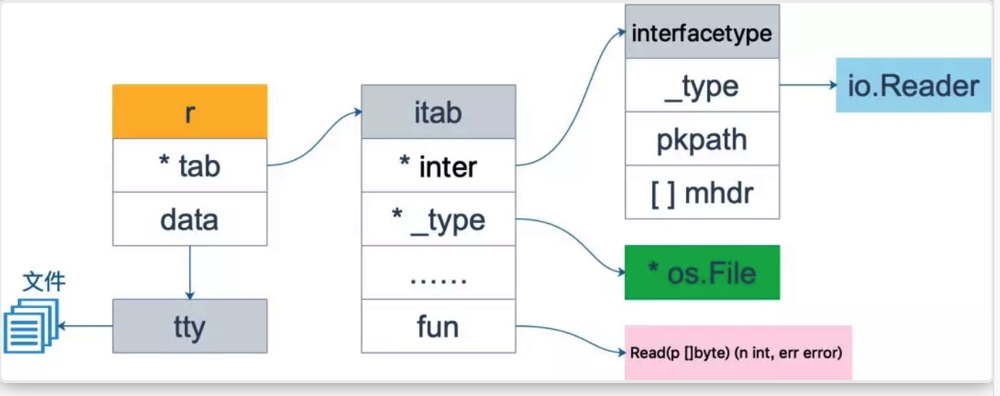
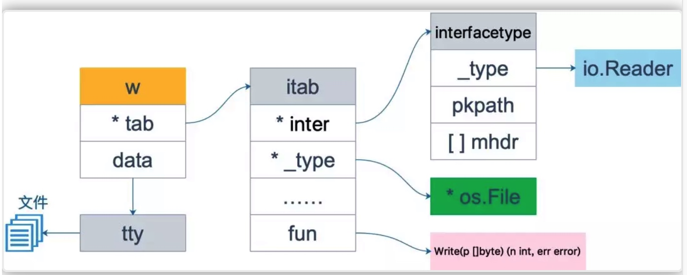
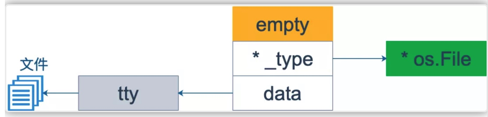
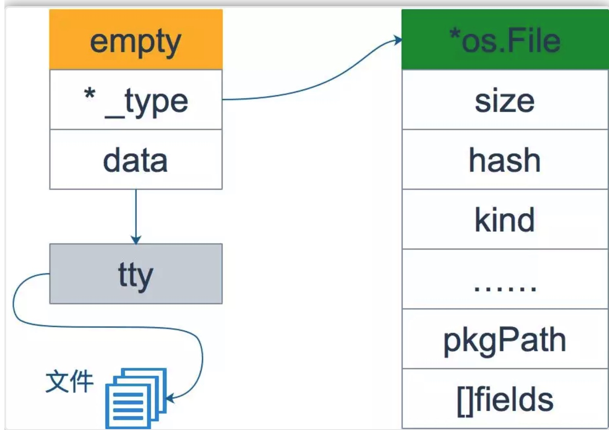
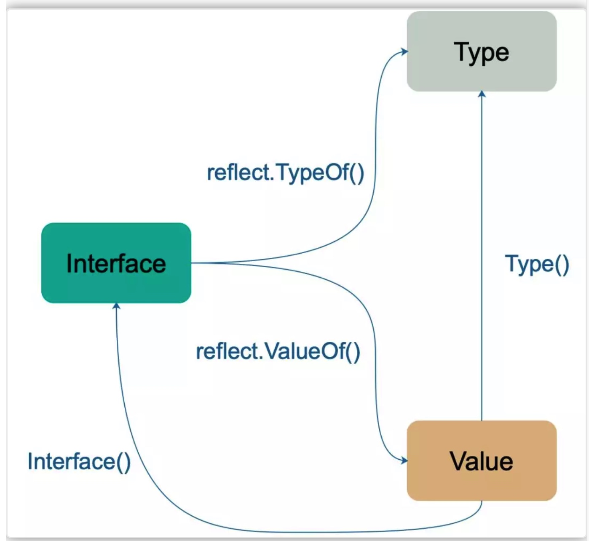

# 反射 
[反射的讲解    ww](https://mp.weixin.qq.com/s?__biz=MzI3MjU4Njk3Ng==&mid=2247483794&idx=1&sn=44c284d6f8fdf75c92a79bd3663d6090&scene=19#wechat_redirect)
在计算机科学中，反射是指计算机程序在运行时（Run time）可以访问、检测和修改它本身状态或行为的一种能力。用比喻来说，反射就是程序在运行的时候能够“观察”并且修改自己的行为。

反射的本质就是程序运行期探知对象的类型信息和内存结构。在 Go语言中是如此定义反射的：
**Go 语言提供了一种机制在运行时更新变量和检查他们的值，调用他们的方法，但是在编译时并不知道这些变量的具体类型，这称为反射机制。**

## 为什么要用反射

需要反射的 2 个常见场景：

1. 有时你需要编写一个函数，但是并不知道传给你的参数类型是什么，可能是没约定好；也可能是传入的类型很多，这些类型并不能统一表示。这时反射就会用的上了。
2. 有时候需要根据某些条件决定调用哪个函数，比如根据用户的输入来决定。这时就需要对函数和函数的参数进行反射，在运行期间动态地执行函数。

在讲反射的原理以及如何用之前，还是说几点不使用反射的理由：
1. 与反射相关的代码，经常是难以阅读的。在软件工程中，代码可读性也是一个非常重要的指标
2. Go 语言作为一门静态语言，编码过程中，编译器能提前发现一些类型错误，但是对于反射代码是无能为力的。所以包含反射相关的代码，很可能会运行很久，才会出错，这时候经常是直接 panic，可能会造成严重的后果。
3. 反射对性能影响还是比较大的，比正常代码运行速度慢一到两个数量级。所以，对于一个项目中处于运行效率关键位置的代码，尽量避免使用反射特性。

##反射是如何实现的
上一篇文章讲到了 interface，它是 Go 语言实现抽象的一个非常强大的工具。当向接口变量赋予一个**实体类型**的时候，接口会存储实体的类型信息，**反射就是通过接口的类型信息实现的，反射建立在类型的基础上**。

Go 语言在 reflect 包里定义了各种类型，实现了反射的各种函数，通过它们可以在运行时检测类型的信息、改变类型的值。

### types 和 interface
反射主要与 interface{} 类型相关。前面一篇关于 interface 相关的文章已经探讨过 interface 的底层结构，这里再来复习一下。


```go
type iface 
struct
 {

    tab  *itab

    data 
unsafe
.
Pointer

}


type itab 
struct
 {

    inter  *interfacetype

    _type  *_type

    link   *itab

    hash   uint32

    bad    
bool

    inhash 
bool

    unused [
2
]
byte

    fun    [
1
]uintptr

}
```


其中 itab 由具体类型 _type 以及 `interfacetype` 组成。 _type 表示具体类型，而 `interfacetype` 则表示具体类型实现的接口类型。

明确一点：**接口变量可以存储任何实现了接口定义的所有方法的变量。**


```go
type 
Reader
 
interface
 {

    
Read
(p []
byte
) (n 
int
, err error)

}


type 
Writer
 
interface
 {

    
Write
(p []
byte
) (n 
int
, err error)

}
```

接下来，就是接口之间的各种转换和赋值了：

```go
var
 r io.
Reader

tty, err := os.
OpenFile
(
"/Users/qcrao/Desktop/test"
, os.O_RDWR, 
0
)

if
 err != 
nil
 {

    
return
 
nil
, err

}

r = tty
```


首先声明 r 的类型是 io.Reader，注意，这是 r 的静态类型，此时它的动态类型为 nil，并且它的动态值也是 nil。

之后， r=tty 这一语句，将 r 的动态类型变成 *os.File，动态值则变成非空，表示打开的文件对象。这时，r 可以用 <value,type>对来表示为： <tty, *os.File>。



注意看上图，此时虽然 fun 所指向的函数只有一个 Read 函数，其实 *os.File 还包含 Write 函数，也就是说 *os.File 其实还实现了 io.Writer 接口。因此下面的断言语句可以执行：

```go
var w io.Writer

w = r.(io.Writer)
```

之所以用断言，而不能直接赋值，是因为 r 的静态类型是 io.Reader，并没有实现 io.Writer 接口。断言能否成功，看 r 的动态类型是否符合要求。

这样，w 也可以表示成 <tty, *os.File>，仅管它和 r 一样，但是 w 可调用的函数取决于它的静态类型 io.Writer，也就是说它只能有这样的调用形式： w.Write() 。 w 的内存形式如下图



和 r 相比，仅仅是 fun 对应的函数变了： Read->Write。


最后，再来一个赋值：

```go
var empty interface{}
empty = w
```

因为 empty 是一个空接口，因此所有的类型都实现了它，w 可以直接赋值给它，不需要执行断言操作。




从上面的三张图可以看到，interface 包含三部分信息： _type 是类型信息， *data指向实际类型的实际值， itab 包含实际类型的信息，包括大小、包路径，还包含绑定在类型上的各种方法（图上没有画出方法），补充一下关于 os.File 结构体的图：


### 反射的基本函数
reflect 包里定义了一个接口和一个结构体，即 reflect.Type 和 reflect.Value，它们提供很多函数来获取存储在接口里的类型信息。



总结一下： TypeOf() 函数返回一个接口，这个接口定义了一系列方法，利用这些方法可以获取关于类型的所有信息； ValueOf() 函数返回一个结构体变量，包含类型信息以及实际值。

### 反射的三大定律
根据 Go 官方关于反射的博客，反射有三大定律：

1. Reflection goes from interface value to reflection object.
2. Reflection goes from reflection object to interface value.
3. To modify a reflection object, the value must be settable.


第一条最为基本：**反射是一种检测存储在` interface`中的类型好值的机制。这可以通过 TypeOf 函数和 ValueOf 函数得到**

第二条实际上和第一条是相反的机制，它将 ValueOf 的返回值通过 Interface() 函数反向转变成 interface 变量。


前两条就是说 **接口型变量** 和 **反射类型对象** 可以相互转化，反射类型对象实际上就是指的前面说的 reflect.Type 和 reflect.Value。

第三条不太好懂：如果需要操作一个反射变量，那么它必须是可设置的。反射变量可设置的本质是它存储了原变量本身，这样对反射变量的操作，就会反映到原变量本身；反之，如果反射变量不能代表原变量，那么操作了反射变量，不会对原变量产生任何影响，这会给使用者带来疑惑。所以第二种情况在语言层面是不被允许的。


```go
var x float64 = 3.4

v := reflect.ValueOf(x)

v.SetFloat(7.1) 
// Error: will panic.
```

执行上面的代码会产生 panic，原因是反射变量 v 不能代表 x 本身，为什么？因为调用 reflect.ValueOf(x) 这一行代码的时候，传入的参数在函数内部只是一个拷贝，是值传递，所以 v 代表的只是 x 的一个拷贝，因此对 v 进行操作是被禁止的。

可设置是反射变量 Value 的一个性质，但不是所有的 Value 都是可被设置的。

就像在一般的函数里那样，当我们想改变传入的变量时，使用**指针**就可以解决了。


```go
var x float64 = 3.4

p := reflect.ValueOf(&x)

fmt.
Println
(
"type of p:"
, p.
Type
())

fmt.Printn("settability of p:", p.CanSet())
```

输出是这样的：

```
type of p: *float64

settability of p: 
false
```

p 还不是代表 x， p.Elem() 才真正代表 x，这样就可以真正操作 x 了：

```
v := p.Elem()

v.SetFloat(7.1)

fmt.Println(v.Interface()) 
// 7.1

fmt.Println(x) 
// 7.1
```

**关于第三条规则，可以理解为：如果想要操作原变量，反射变量 value 必须要 hold 住原变量的地址才行**。和指针与值的关系很像。

## 反射相关函数的使用

